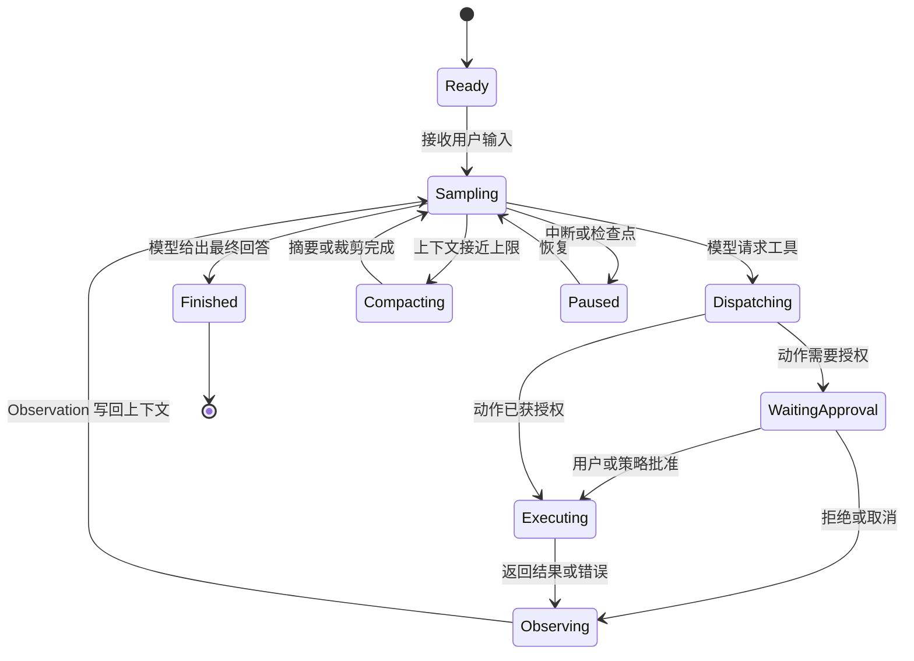

# Agent Runtime 总图

## 1. 一个统一模型

无论框架外观如何，核心通常都能还原为以下状态机：



最小实现只需要 `Sampling -> Executing -> Sampling`。生产实现还要处理审批、隔离、并发、
取消、预算、压缩、恢复和审计。

## 2. 七个内核子系统

| 子系统 | 主要职责 | 常见对象 |
| --- | --- | --- |
| 上下文管理 | 选择本轮模型可见的信息 | messages、history、view、compaction |
| 推理驱动 | 调模型并解释停止原因 | model client、stream、stop reason |
| 工具系统 | 注册、描述、解析和路由动作 | Tool、registry、router、MCP |
| 执行环境 | 真正运行命令或代码 | subprocess、Python executor、workspace |
| 安全控制 | 判断动作是否允许 | policy、approval、sandbox、guardrail |
| 调度控制 | 循环、并发、取消、预算、子 Agent | turn、task、event loop、scheduler |
| 状态与观测 | 持久化、恢复、指标和追踪 | event log、trajectory、trace、session |

## 3. Agent 为什么像操作系统

### 模型是策略，Runtime 是机制

模型决定“下一步想做什么”，Runtime 决定“这个动作能否做、在哪里做、如何记录结果”。
这对应操作系统中策略与机制的分离。

### 工具调用是系统调用

Tool schema 是 ABI，tool call 是系统调用请求，tool result 是返回值。模型不能直接触碰文件、
网络或进程，只能通过 Runtime 暴露的能力。

### 上下文窗口是稀缺内存

消息、代码、日志和工具输出会争夺 token。裁剪、摘要、缓存、外置存储和按需注入，分别类似
内存回收、压缩、页缓存、交换区和按需分页。

### 沙箱是保护域

工作目录、可写路径、网络权限、环境变量和进程能力共同构成执行保护域。审批相当于一次临时
提权，而不是永久扩大权限。

### Thread、Turn、Step 像调度层级

- Thread/Conversation：长期任务容器。
- Turn/Run：一次用户意图的生命周期。
- Step/Cycle：一次模型采样与动作反馈。
- Tool execution：具体 I/O 或计算任务。

不同框架术语不同，但层级大体一致。

## 4. 必须分清的四类状态

| 类型 | 示例 | 生命周期 |
| --- | --- | --- |
| 对话上下文 | system/user/assistant/tool messages | 随模型调用增长并可能压缩 |
| 控制状态 | running、paused、finished、step count | 驱动状态机 |
| 环境状态 | 文件、Git diff、进程、容器 | 存在于模型上下文之外 |
| 持久记录 | trajectory、event log、rollout | 用于恢复、审计和重放 |

把四者塞进一个 `messages` 数组，最初很简单，但会迅速失去并发控制、恢复能力和审计边界。

## 5. 最小参考伪代码

```python
state = initialize(task)

while not state.terminal:
    enforce_budget(state)
    prompt = context_manager.build(state)
    response = model.generate(prompt, tool_specs)

    for request in parse_actions(response):
        decision = policy.authorize(request, state)
        result = executor.run(request, decision.sandbox)
        state.append_observation(request, result)

    if response.is_final:
        state.finish(response)

    persistence.checkpoint(state)
```

五个框架的差异，主要就在这些函数分别有多厚、边界有多清晰。

## 6. 阅读源码时先问什么

1. 主循环在哪里，继续循环的布尔条件是什么？
2. 模型停止原因如何映射到完成、工具调用或错误？
3. 工具 schema 在哪里构建，调用在哪里被解析和分发？
4. 命令实际在哪个进程、容器或沙箱中运行？
5. 权限检查发生在解析前、分发前还是执行前？
6. Tool result 如何写回模型上下文？
7. 中断、超时、预算和上下文溢出如何终止或恢复？
8. 哪些状态能跨进程重启恢复？
9. 子 Agent 是普通 Tool、独立会话还是调度器管理的任务？
10. UI/CLI 与 Agent 内核之间用什么协议通信？

